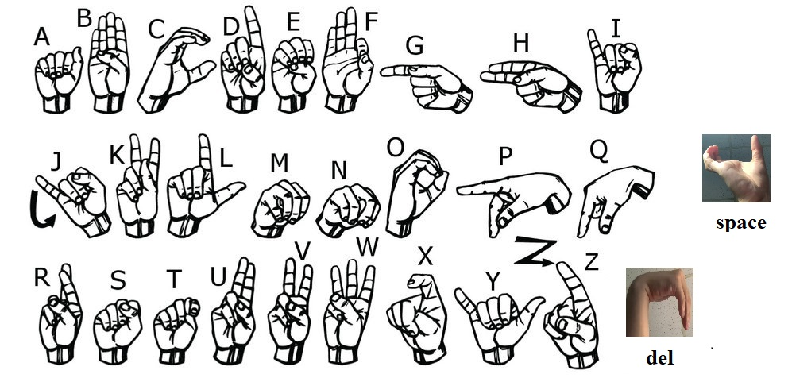

# AlphabeticSignLanguage

## Mô tả dự án

Dự án nhận diện ngôn ngữ ký hiệu bảng chữ cái tiếng Anh (American Alphabet) sử dụng học máy và xử lý ảnh. Hệ thống gồm các bước: thu thập dữ liệu hình ảnh, trích xuất đặc trưng bàn tay bằng MediaPipe, huấn luyện mô hình MLPClassifier, đánh giá kết quả và nhận diện ký hiệu theo thời gian thực qua camera.

## Hình ảnh các ký hiệu đã train



## Mô tả dataset tôi đã train

- Gồm 28 class (26 ký tự trong bảng chữ cái tiếng Anh + 2 ký tự DELETE và SPACE)
- Tổng bộ dữ liệu có hơn 66800 ảnh

## Cấu trúc thư mục

- `create_dataset/`: Đây là bộ dữ liệu mang tính chất họa. Hãy để các ảnh vào các folder tương ứng để tạo bộ dữ liệu của riêng bạn
- `MLPClassifier/`: Notebook huấn luyện, đánh giá mô hình, lưu model, báo cáo kết quả.
- `main.py`: Hãy chạy file này để xem độ chính xác của mô hình (Test real time qua camera)
- `requirements.txt`: Danh sách thư viện cần thiết.

## Hướng dẫn cài đặt

1. Python tôi dùng = 3.10.11
2. Cài các thư viện:
   ```
   pip install -r requirements.txt
   ```
3. Tạo dữ liệu mới trong `create_dataset/dataset/` theo từng ký tự.

## Huấn luyện & đánh giá mô hình

- Chạy notebook `MLPClassifier/create_model.ipynb` để:
  - Trích xuất đặc trưng từ ảnh.
  - Huấn luyện mô hình MLPClassifier.
  - Đánh giá độ chính xác, precision, recall, F1, xuất ma trận nhầm lẫn và báo cáo chi tiết.
  - Đánh giá mô hình qua camera

## Nhận diện ký hiệu qua camera

- Chạy:
  ```
  python main.py
  ```
- Đưa tay vào khung hình webcam, hệ thống sẽ nhận diện và hiển thị xác suất từng ký tự.

## Người thực hiện

- Nguyễn Hữu Tuấn

---
